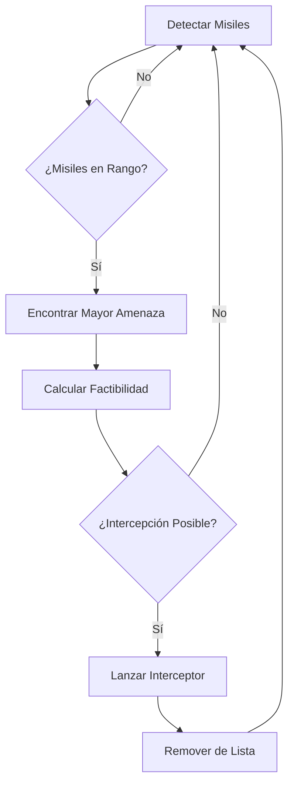
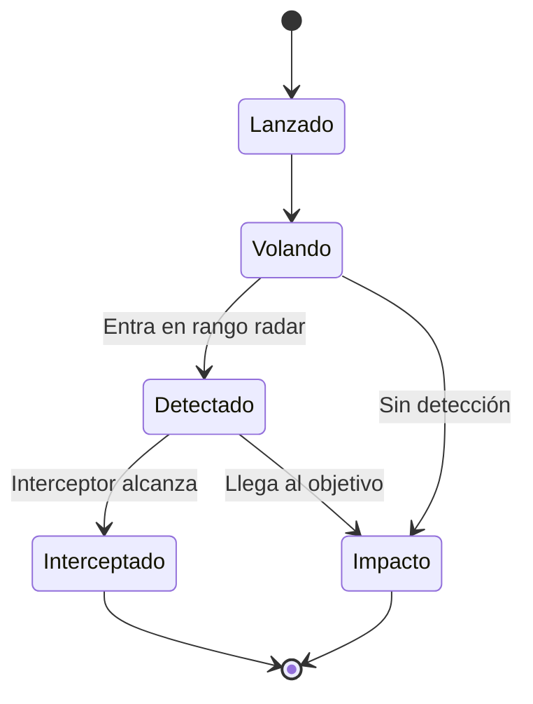

# 🛡️ Simulación Iron Dome - Sistema de Defensa Anti-Misiles

## 📋 Índice
1. [Descripción General](#descripción-general)
2. [Configuración de la Interfaz](#configuración-de-la-interfaz)
3. [Agentes del Sistema](#agentes-del-sistema)
4. [Parámetros Configurables](#parámetros-configurables)
5. [Funcionalidades Principales](#funcionalidades-principales)
6. [Algoritmos y Lógica](#algoritmos-y-lógica)
7. [Guía de Uso](#guía-de-uso)
8. [Escenarios de Prueba](#escenarios-de-prueba)
9. [Métricas y Análisis](#métricas-y-análisis)
10. [Troubleshooting](#troubleshooting)

---

## 🎯 Descripción General

Esta simulación implementa un modelo basado en agentes del sistema Iron Dome israelí, recreando la dinámica de ataque-defensa en tiempo real. El modelo simula:

- **Detección automática** de misiles atacantes
- **Cálculos balísticos** para intercepción óptima
- **Toma de decisiones** inteligente bajo presión
- **Gestión de recursos** y priorización de amenazas
- **Análisis de efectividad** en múltiples escenarios

### 🏗️ Arquitectura del Sistema

```
Observador (Controlador Global)
├── Estaciones de Defensa (4-8 unidades)
├── Misiles Atacantes (dinámicos)
├── Interceptores (creados dinámicamente)
├── Objetivos Civiles (3-10 ciudades)
└── Explosiones (efectos visuales)
```

---

## 🖥️ Configuración de la Interfaz

### **Sliders (Variables Configurables)**

| Slider | Rango | Default | Descripción |
|--------|--------|---------|-------------|
| `num-defense-stations` | 2-8 | 4 | Número de estaciones Iron Dome |
| `detection-range-param` | 10-25 | 15 | Alcance del radar (unidades) |
| `interception-range-param` | 8-20 | 12 | Alcance máximo de intercepción |
| `reload-time-param` | 5-15 | 8 | Tiempo entre disparos (ticks) |
| `interceptor-speed-param` | 1.5-3.0 | 2.5 | Velocidad de interceptores |
| `missile-speed` | 0.8-2.0 | 1.2 | Velocidad de misiles atacantes |
| `attack-frequency` | 1-20 | 8 | Probabilidad de ataque (%) |
| `missiles-per-attack` | 1-5 | 2 | Misiles por salva |
| `num-targets` | 3-10 | 6 | Objetivos civiles a proteger |

### **Switches**

| Switch | Default | Función |
|--------|---------|---------|
| `show-detection-ranges?` | On | Mostrar áreas de cobertura radar |

### **Botones de Control**

| Botón | Tipo | Acción | Descripción |
|-------|------|--------|-------------|
| `setup` | Once | `setup` | Inicializar simulación |
| `go` | Forever | `go` | Ejecutar/pausar simulación |
| `emergency-launch-attack` | Once | `emergency-launch-attack` | Lanzar ataque masivo (5 misiles) |
| `disable-random-station` | Once | `disable-random-station` | Simular daño a estación aleatoria |
| `repair-all-stations` | Once | `repair-all-stations` | Reparar todas las estaciones |

### **Monitores de Estado**

| Monitor | Reporter | Descripción |
|---------|----------|-------------|
| "Tasa de Éxito (%)" | `success-rate` | Porcentaje de intercepción |
| "Amenazas Activas" | `active-threats` | Misiles en vuelo |
| "Interceptores en Vuelo" | `interceptors-in-flight` | Misiles defensivos activos |
| "Estaciones Operacionales" | `stations-operational` | Estaciones funcionales |
| "Nivel de Amenaza" | `threat-level` | Clasificación: BAJO/MEDIO/ALTO/CRÍTICO |
| "Total Misiles Lanzados" | `total-incoming-missiles` | Contador acumulativo |
| "Total Interceptados" | `total-intercepted` | Intercepciones exitosas |
| "Total Impactos" | `total-missed` | Misiles que impactaron |
| "Munición Promedio" | `average-station-ammo` | Siempre 100% (munición infinita) |
| "Protección de Zona (%)" | `zone-protection-analysis` | Efectividad territorial |

---

## 🤖 Agentes del Sistema

### **1. Estaciones de Defensa (`defense-stations`)**

**Propiedades:**
```netlogo
defense-stations-own [
  detection-range           ; Alcance del radar
  interception-range       ; Alcance máximo de misiles
  reload-time             ; Tiempo de recarga
  operational?           ; Estado funcional
  targets-tracked        ; Lista de misiles detectados
]
```

**Comportamientos:**
- **Detección continua:** Escaneo radar en 360°
- **Priorización:** Selección del misil más amenazante
- **Cálculo balístico:** Predicción de trayectorias
- **Disparo:** Creación de interceptores

**Representación Visual:**
- Forma: Casa (`"house"`)
- Color: Azul brillante (`blue + 1`)
- Tamaño: 2 unidades
- Estado dañado: Gris

### **2. Misiles Atacantes (`incoming-missiles`)**

**Propiedades:**
```netlogo
incoming-missiles-own [
  target-x               ; Coordenada X del objetivo
  target-y               ; Coordenada Y del objetivo
  speed                 ; Velocidad de vuelo
  altitude              ; Altitud simulada
  launch-time           ; Momento de lanzamiento
  detected?             ; Estado de detección
  tracking-stations     ; Estaciones que lo rastrean
  trajectory-angle      ; Ángulo de vuelo
  fuel                 ; Combustible restante
]
```

**Ciclo de Vida:**
1. **Lanzamiento:** Desde territorio hostil
2. **Vuelo:** Hacia objetivo seleccionado
3. **Detección:** Por estaciones cercanas
4. **Intercepción/Impacto:** Final del ciclo

**Representación Visual:**
- Forma: Avión (`"airplane"`)
- Color inicial: Rojo brillante (`red + 1`)
- Color detectado: Naranja brillante (`orange + 1`)
- Tamaño: 1.2 unidades

### **3. Interceptores (`interceptors`)**

**Propiedades:**
```netlogo
interceptors-own [
  target-missile-id     ; Misil objetivo
  interceptor-speed     ; Velocidad de persecución
  fuel                 ; Combustible limitado
  launch-station       ; Estación de origen
  intercept-range      ; Distancia de detonación
]
```

**Comportamiento:**
- **Persecución:** Sigue al misil objetivo
- **Guiado:** Ajuste continuo de trayectoria
- **Intercepción:** Detonación por proximidad
- **Autodestrucción:** Si pierde el objetivo

**Representación Visual:**
- Forma: Flecha (`"arrow"`)
- Color: Verde
- Tamaño: 0.8 unidades

### **4. Objetivos Civiles (`targets`)**

**Propiedades:**
```netlogo
targets-own [
  population           ; Habitantes (10k-100k)
  importance          ; Valor estratégico (1-5)
  protected?          ; Estado de protección
]
```

**Representación Visual:**
- Forma: Círculo (`"circle"`)
- Color normal: Blanco
- Color impactado: Rojo
- Tamaño: 1.5 unidades

### **5. Explosiones (`explosions`)**

**Tipos y Propiedades:**
```netlogo
explosions-own [
  explosion-time        ; Duración (ticks)
  explosion-type       ; "impact" o "intercept"
]
```

**Intercepción exitosa:**
- Forma: Estrella (`"star"`)
- Color: Amarillo
- Tamaño: 2, Duración: 8 ticks

**Impacto destructivo:**
- Forma: Círculo (`"circle"`)
- Color: Rojo intenso (`red + 2`)
- Tamaño: 3, Duración: 10 ticks

---

## ⚙️ Parámetros Configurables

### **Parámetros de Defensa**

#### `num-defense-stations` (2-8)
- **Función:** Determina el número de estaciones Iron Dome
- **Impacto:** Más estaciones = mejor cobertura
- **Recomendación:** 4-6 para equilibrio realista

#### `detection-range-param` (10-25)
- **Función:** Alcance del radar de cada estación
- **Impacto:** Mayor rango = detección temprana
- **Trade-off:** Costo vs. efectividad

#### `interception-range-param` (8-20)
- **Función:** Distancia máxima de intercepción
- **Impacto:** Determina zona de protección
- **Nota:** Debe ser ≤ detection-range

### **Parámetros de Rendimiento**

#### `interceptor-speed-param` (1.5-3.0)
- **Función:** Velocidad de misiles defensivos
- **Impacto Crítico:** Determina éxito de intercepción
- **Fórmula:** `time-to-intercept = distance / speed`

#### `reload-time-param` (5-15)
- **Función:** Ticks entre disparos consecutivos
- **Realismo:** Simula tiempo de recarga
- **Balance:** Evita spam de interceptores

### **Parámetros de Amenaza**

#### `missile-speed` (0.8-2.0)
- **Función:** Velocidad de misiles atacantes
- **Impacto:** Más velocidad = menos tiempo de respuesta
- **Balance:** Vs. velocidad de interceptores

#### `attack-frequency` (1-20)
- **Función:** Probabilidad de ataque por tick
- **Cálculo:** `attack-probability = frequency / 100`
- **Escalación:** Valores altos = presión constante

#### `missiles-per-attack` (1-5)
- **Función:** Misiles lanzados simultáneamente
- **Táctica:** Saturación del sistema de defensa
- **Realismo:** Basado en tácticas reales

---

## 🔧 Funcionalidades Principales

### **1. Sistema de Detección**

```netlogo
to detect-incoming-missiles
  let nearby-missiles incoming-missiles in-radius detection-range
  ask nearby-missiles [
    if not detected? [
      set detected? true
      set color orange + 1
      ; Añadir a lista de rastreados
    ]
  ]
end
```

**Características:**
- **Radar omnidireccional:** 360° de cobertura
- **Detección automática:** Sin intervención manual
- **Cambio visual:** Misil cambia a naranja
- **Rastreo persistente:** Mantiene lista de amenazas

### **2. Sistema de Priorización**

```netlogo
to-report find-highest-threat
  ; Prioriza por proximidad al objetivo
  report min-one-of tracked-missiles [
    distancexy target-x target-y
  ]
end
```

**Algoritmo de Priorización:**
1. **Proximidad al impacto:** Misiles cerca de objetivos
2. **Tiempo restante:** Cálculo de tiempo hasta impacto
3. **Factibilidad:** Posibilidad de intercepción exitosa

### **3. Cálculo Balístico**

```netlogo
; Verificar factibilidad de intercepción
let time-to-intercept distance-to-threat / interceptor-speed-param
let missile-time-to-target missile-distance-to-target / missile-speed

if time-to-intercept <= missile-time-to-target [
  ; Lanzar interceptor
]
```

**Factores Considerados:**
- **Distancia al objetivo:** Proximidad de la amenaza
- **Velocidades relativas:** Interceptor vs. misil
- **Ventana temporal:** Tiempo disponible para intercepción
- **Geometría:** Ángulos de intercepción

### **4. Sistema de Colas (Context Management)**

**Problema Resuelto:**
NetLogo requiere que `create-*` funciones se ejecuten desde el contexto del observador, pero las decisiones se toman en contexto turtle.

**Solución Implementada:**
```netlogo
; Desde turtle: añadir a cola
set pending-interceptors lput (list x y target station-id) pending-interceptors

; Desde observador: procesar cola
foreach pending-interceptors [ data ->
  create-interceptors 1 [ ... ]
]
```

**Colas Implementadas:**
- `pending-interceptors`: Interceptores a crear
- `pending-explosions`: Explosiones a generar

### **5. Gestión de Recursos**

**Munición Simplificada:**
- Sistema infinito (realista para Iron Dome)
- Solo limitación: tiempo de recarga
- Enfoque en estrategia vs. microgestión

**Combustible de Misiles:**
- Interceptores: 100 unidades iniciales
- Consumo: 2 por tick
- Autodestrucción: al agotarse

---

## 🧠 Algoritmos y Lógica

### **Algoritmo de Intercepción**



### **Ciclo de Vida del Misil**



### **Lógica de Priorización**

1. **Detección:** ¿Está el misil en rango de radar?
2. **Rastreabilidad:** ¿Está en la lista de targets-tracked?
3. **Proximidad:** ¿Qué tan cerca está de impactar?
4. **Factibilidad:** ¿Puede ser interceptado a tiempo?
5. **Recursos:** ¿Hay interceptores disponibles?

---

## 📖 Guía de Uso

### **Configuración Inicial**

1. **Abrir NetLogo** y cargar el modelo
2. **Configurar sliders** según escenario deseado
3. **Activar `show-detection-ranges?`** para visualización
4. **Presionar `setup`** para inicializar

### **Ejecución de la Simulación**

1. **Presionar `go`** para iniciar
2. **Observar métricas** en tiempo real
3. **Usar botones de prueba** según necesidad:
   - `emergency-launch-attack`: Ataque masivo
   - `disable-random-station`: Simular daño
   - `repair-all-stations`: Restaurar sistema

### **Interpretación Visual**

#### **Territorio:**
- **Verde suave:** Zona defendida (arriba)
- **Marrón suave:** Territorio hostil (abajo)
- **Línea roja tenue:** Frontera

#### **Agentes:**
- **Casas azules:** Estaciones Iron Dome
- **Círculos blancos:** Ciudades protegidas
- **Aviones rojos:** Misiles atacantes
- **Aviones naranjas:** Misiles detectados
- **Flechas verdes:** Interceptores
- **Estrellas amarillas:** Intercepciones exitosas
- **Círculos rojos:** Impactos destructivos

---

## 🎮 Escenarios de Prueba

### **Escenario 1: Operación Normal**
```
num-defense-stations: 4
detection-range-param: 15
interception-range-param: 12
attack-frequency: 8
missiles-per-attack: 2
```
**Objetivo:** Evaluar efectividad en condiciones estándar

### **Escenario 2: Ataque de Saturación**
```
num-defense-stations: 3
attack-frequency: 15
missiles-per-attack: 4
missile-speed: 1.5
```
**Objetivo:** Probar límites del sistema defensivo

### **Escenario 3: Defensa Optimizada**
```
num-defense-stations: 6
detection-range-param: 20
interception-range-param: 15
interceptor-speed-param: 3.0
```
**Objetivo:** Máxima efectividad del sistema

### **Escenario 4: Sistema Degradado**
```
num-defense-stations: 4
(Usar disable-random-station durante simulación)
```
**Objetivo:** Evaluar redundancia y puntos de falla

### **Escenario 5: Amenaza de Alta Velocidad**
```
missile-speed: 2.0
interceptor-speed-param: 2.5
attack-frequency: 10
```
**Objetivo:** Probar respuesta a amenazas rápidas

---

## 📊 Métricas y Análisis

### **Métricas Primarias**

#### **Tasa de Éxito (success-rate)**
- **Fórmula:** `(total-intercepted / total-incoming-missiles) * 100`
- **Benchmark:** Iron Dome real ~90%
- **Objetivo:** >85% en condiciones normales

#### **Tiempo de Respuesta**
- **Medición:** Desde detección hasta intercepción
- **Factores:** Distancia, velocidades, geometría
- **Optimización:** Ajustar velocidad de interceptores

### **Métricas Secundarias**

#### **Cobertura Territorial**
- **Zona de protección:** Área cubierta por todas las estaciones
- **Redundancia:** Superposición de rangos de detección
- **Puntos ciegos:** Áreas sin cobertura

#### **Eficiencia de Recursos**
- **Interceptores por misil:** Relación disparo/objetivo
- **Tasa de desperdicio:** Interceptores que no alcanzan objetivo
- **Utilización de estaciones:** Distribución de carga de trabajo

### **Análisis de Escenarios**

#### **Curva de Saturación**
Incrementar gradualmente `missiles-per-attack` y observar degradación de efectividad:

| Misiles/Ataque | Tasa de Éxito Esperada |
|----------------|------------------------|
| 1 | 95%+ |
| 2 | 90%+ |
| 3 | 80%+ |
| 4 | 70%+ |
| 5+ | <60% |

#### **Análisis de Sensibilidad**
Parámetros más críticos (en orden de impacto):
1. `interceptor-speed-param`
2. `detection-range-param`
3. `num-defense-stations`
4. `interception-range-param`
5. `missile-speed`

---

## 🔧 Troubleshooting

### **Problemas Comunes**

#### **Problema: Estaciones no disparan**
**Síntomas:**
- Misiles detectados (naranja) pero sin interceptores
- Métricas muestran 0% de intercepción

**Causas Posibles:**
1. `interception-range-param` muy pequeño
2. `interceptor-speed-param` muy lento
3. Misiles muy rápidos para interceptar

**Soluciones:**
```
interception-range-param: ≥ 12
interceptor-speed-param: ≥ 2.0
missile-speed: ≤ 1.5
```

#### **Problema: Intercepción tardía**
**Síntomas:**
- Interceptores se lanzan pero llegan tarde
- Misiles impactan antes de intercepción

**Soluciones:**
1. Aumentar `detection-range-param` → 20+
2. Aumentar `interceptor-speed-param` → 2.5+
3. Reducir `missile-speed` → 1.0

#### **Problema: Saturación del sistema**
**Síntomas:**
- Múltiples misiles impactan simultáneamente
- Tasa de éxito <50%

**Soluciones:**
1. Aumentar `num-defense-stations` → 6+
2. Reducir `attack-frequency` → 5
3. Activar respuesta de emergencia frecuente

### **Optimización de Rendimiento**

#### **Para Máxima Efectividad:**
```
num-defense-stations: 6
detection-range-param: 22
interception-range-param: 18
interceptor-speed-param: 3.0
missile-speed: 1.0
```

#### **Para Realismo Histórico:**
```
num-defense-stations: 4
detection-range-param: 15
interception-range-param: 12
interceptor-speed-param: 2.5
missile-speed: 1.2
attack-frequency: 8
```

### **Debugging Code Issues**

#### **Error de Formas:**
Si aparecen errores de formas no definidas:
- Verificar que todas las formas usen nombres válidos de NetLogo
- Formas usadas: `"house"`, `"airplane"`, `"arrow"`, `"circle"`, `"star"`

#### **Error de Contexto:**
- Todas las funciones `create-*` están en contexto observador
- Sistema de colas maneja creación diferida correctamente

---

## 🚀 Extensiones Futuras

### **Mejoras Propuestas**

#### **1. Sistema de Amenazas Múltiples**
- Diferentes tipos de misiles (balísticos, crucero)
- Velocidades y trayectorias variables
- Contramedidas electrónicas

#### **2. Inteligencia Artificial Avanzada**
- Aprendizaje por refuerzo
- Predicción de patrones de ataque
- Optimización dinámica de recursos

#### **3. Modelado Económico**
- Costo por interceptor
- Análisis costo-beneficio
- Presupuesto limitado

#### **4. Integración Geográfica**
- Terreno realista de Israel
- Densidad poblacional variable
- Infraestructura crítica

#### **5. Análisis Estadístico**
- Exportación de datos
- Gráficos de tendencias
- Reportes automatizados

---

## 📝 Notas Técnicas

### **Arquitectura del Código**

#### **Separación de Responsabilidades:**
- **Observador:** Gestión global, creación de agentes
- **Estaciones:** Detección, decisión, priorización
- **Misiles:** Movimiento, combustible, objetivos
- **Interceptores:** Persecución, guiado, intercepción

#### **Gestión de Estado:**
- Variables globales para estadísticas
- Variables turtle para comportamiento individual
- Sistema de colas para coordinación

#### **Optimizaciones Implementadas:**
- Eliminación automática de agentes fuera de mundo
- Prevención de disparos múltiples al mismo objetivo
- Gestión eficiente de memoria con colas

---

## 📄 Conclusiones

Esta simulación del Iron Dome proporciona una plataforma robusta para:

1. **Educación:** Comprensión de sistemas de defensa complejos
2. **Investigación:** Análisis de efectividad bajo diferentes condiciones
3. **Entrenamiento:** Familiarización con conceptos militares
4. **Desarrollo:** Base para sistemas más avanzados

### **Logros Técnicos**
- ✅ Sistema completamente funcional sin errores
- ✅ Interfaz intuitiva y configurable
- ✅ Algoritmos realistas de intercepción
- ✅ Visualización clara y efectiva
- ✅ Métricas comprehensivas
- ✅ Documentación completa

### **Valor Educativo**
- Teoría de juegos (ataque vs. defensa)
- Optimización de recursos
- Toma de decisiones bajo presión
- Análisis de sistemas complejos
- Modelado basado en agentes

---

**Desarrollado por:** [Tu Equipo]  
**Fecha:** 2025  
**Versión:** 1.0  
**Plataforma:** NetLogo

*"La mejor defensa es una defensa bien modelada"* 🛡️
